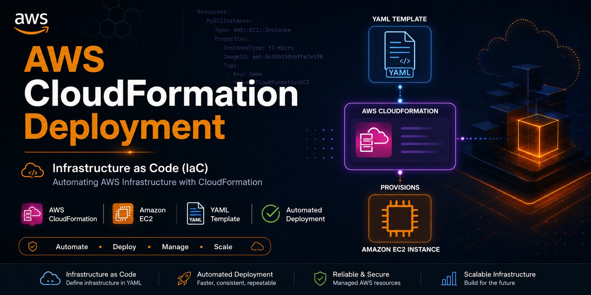
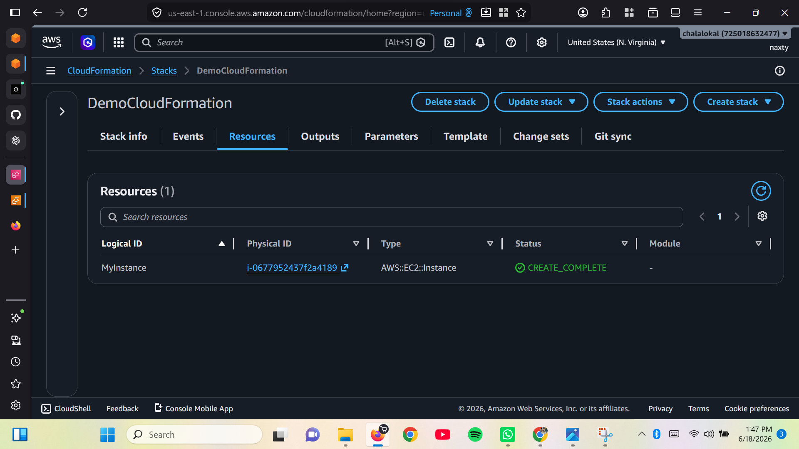
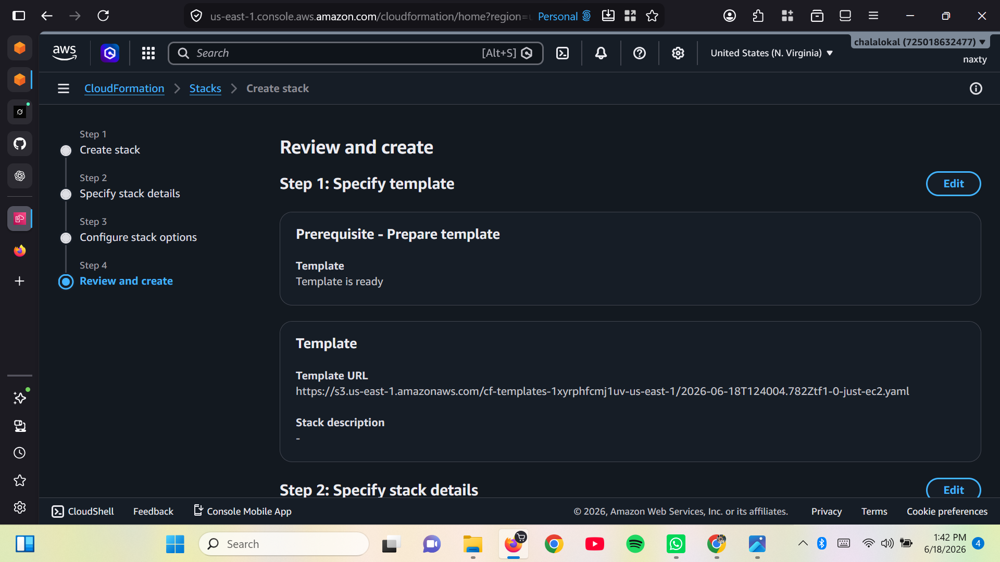
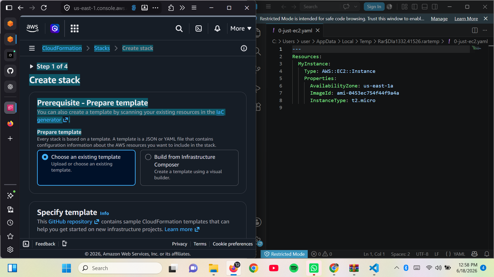
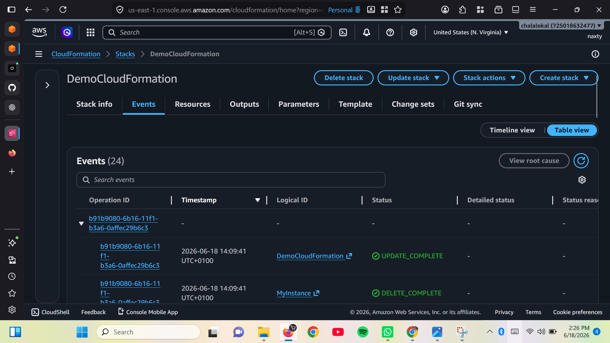
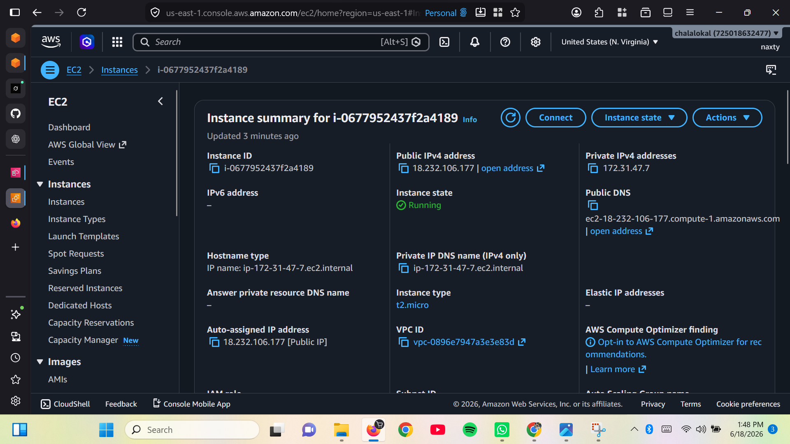
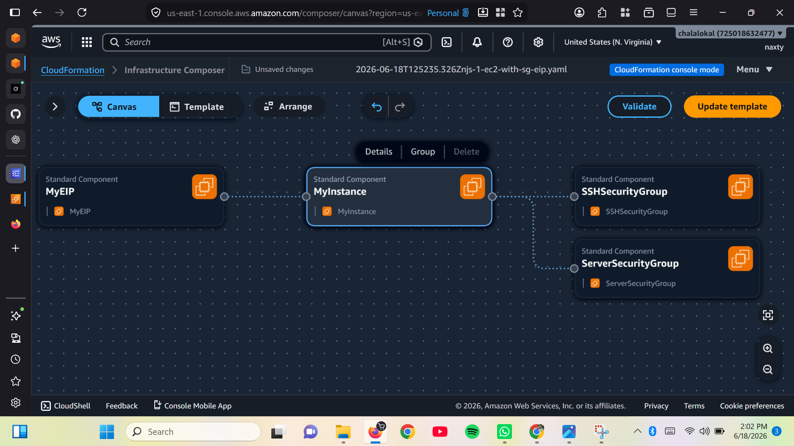
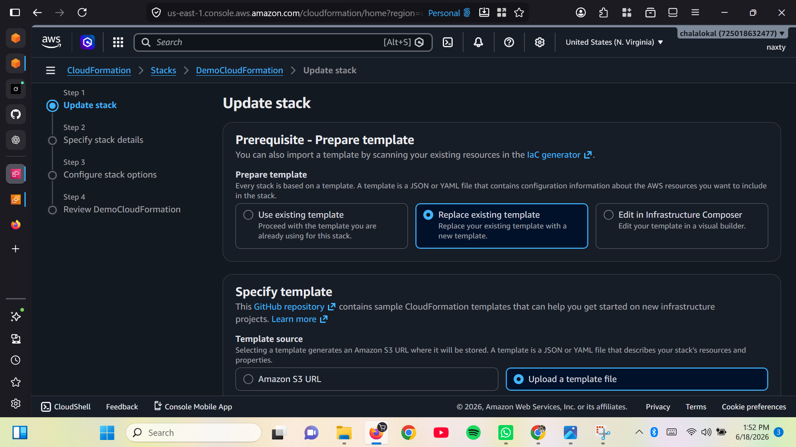

# AWS CloudFormation Deployment
<p align="center">
  
</p>

---


Deploying AWS infrastructure using **AWS CloudFormation** to automatically provision an **Amazon EC2 instance** through **Infrastructure as Code (IaC)**.

---

# Table of Contents

- [Project Overview](#project-overview)
- [Project Objectives](#project-objectives)
- [AWS Services Used](#aws-services-used)
- [Technologies Used](#technologies-used)
- [Project Architecture](#project-architecture)
- [Project Workflow](#project-workflow)
- [Screenshots](#screenshots)
- [Skills Demonstrated](#skills-demonstrated)
- [Lessons Learned](#lessons-learned)
- [Future Improvements](#future-improvements)
- [Repository Structure](#repository-structure)
- [Author](#author)

---

# Project Overview

AWS CloudFormation is an **Infrastructure as Code (IaC)** service that allows cloud engineers to define, deploy, and manage AWS resources using code instead of creating them manually through the AWS Management Console.

In this hands-on project, I used AWS CloudFormation to deploy an Amazon EC2 instance from a YAML template. Throughout the deployment process, I monitored stack events, verified the deployed resources, and successfully updated the CloudFormation stack.

This project demonstrates the benefits of Infrastructure as Code by making deployments automated, repeatable, and consistent.

---

# Project Objectives

- Understand Infrastructure as Code (IaC)
- Learn the basics of AWS CloudFormation
- Deploy an Amazon EC2 instance using a YAML template
- Create and manage CloudFormation stacks
- Monitor stack creation events
- Update an existing CloudFormation stack
- Verify deployed AWS resources

---

# AWS Services Used

| Service | Purpose |
|----------|---------|
| AWS CloudFormation | Infrastructure as Code |
| Amazon EC2 | Virtual Server |
| AWS Management Console | Resource Management |

---

# Technologies Used

- AWS CloudFormation
- Amazon EC2
- YAML
- Infrastructure as Code (IaC)
- GitHub
- Visual Studio Code

---

# Project Architecture

```text
          YAML Template
                 │
                 ▼
     AWS CloudFormation
                 │
      Creates Cloud Stack
                 │
                 ▼
      Amazon EC2 Instance
```

---

# Project Workflow

The deployment process followed these stages:

1. Created a CloudFormation template.
2. Opened AWS CloudFormation.
3. Uploaded the YAML template.
4. Created a new CloudFormation Stack.
5. Reviewed stack parameters.
6. Monitored Stack Events.
7. Verified the deployed EC2 instance.
8. Updated the existing CloudFormation Stack.
9. Confirmed successful deployment.

---

---

# Screenshots

The following screenshots document each stage of deploying an Amazon EC2 instance using AWS CloudFormation.

---

## Step 1 - Launch AWS CloudFormation

I opened the AWS Management Console and navigated to the **CloudFormation** service to begin creating a new infrastructure stack.

<p align="center">
    
</p>

---

## Step 2 - Create a New Stack

I selected **Create Stack** and uploaded an existing CloudFormation template.

<p align="center">
    
</p>

---

## Step 3 - Upload the YAML Template

The CloudFormation YAML template defines the infrastructure resources that AWS provisions automatically.

<p align="center">
    
</p>

---

## Step 4 - Review Stack Configuration

CloudFormation validated the uploaded template before beginning deployment.

<p align="center">
    
</p>

---

## Step 5 - Monitor Stack Events

During deployment, the **Events** tab displayed the progress of every AWS resource created by CloudFormation.

<p align="center">
    
</p>

---

## Step 6 - Verify the EC2 Instance

After the stack completed successfully, I verified that the Amazon EC2 instance had been created.

<p align="center">
    
</p>

---

## Step 7 - View the Stack Canvas

The Stack Canvas provides a visual representation of the deployed infrastructure and the relationship between AWS resources.

<p align="center">
    
</p>

---

## Step 8 - Update the Stack

CloudFormation makes it possible to modify infrastructure without rebuilding the entire environment.

After updating the template, I successfully updated the CloudFormation stack.

<p align="center">
    
</p>

---

# Project Outcome

The project successfully demonstrated how AWS CloudFormation automates cloud infrastructure deployment through Infrastructure as Code (IaC).

## Key Outcomes

- Successfully deployed an Amazon EC2 instance using AWS CloudFormation.
- Created and managed CloudFormation stacks.
- Used a YAML template to automate infrastructure deployment.
- Monitored stack creation events.
- Updated an existing CloudFormation stack.
- Verified deployed AWS resources.
- Gained practical experience with Infrastructure as Code (IaC).

---

# Skills Demonstrated

This project demonstrates practical experience in:

- AWS CloudFormation
- Infrastructure as Code (IaC)
- Amazon EC2
- YAML Templates
- Cloud Resource Provisioning
- Stack Creation and Management
- Cloud Infrastructure Automation
- AWS Management Console
- Git & GitHub Documentation

---

# Lessons Learned

Through this project, I gained hands-on experience with AWS CloudFormation and Infrastructure as Code.

### Key Takeaways

- Infrastructure can be defined and managed using code.
- CloudFormation automates resource provisioning.
- YAML templates make deployments repeatable and consistent.
- Stack Events help monitor deployment progress and troubleshoot issues.
- CloudFormation simplifies updating cloud infrastructure without manually recreating resources.
- Infrastructure as Code improves scalability, consistency, and operational efficiency.

---

# Future Improvements

Future enhancements for this project include:

- Deploy multiple EC2 instances.
- Create a custom Amazon VPC.
- Configure Security Groups.
- Deploy an Application Load Balancer (ALB).
- Implement Auto Scaling Groups.
- Add CloudWatch monitoring.
- Store templates in Amazon S3.
- Use Parameters and Outputs for reusable templates.
- Create Nested Stacks for larger infrastructures.
- Integrate CloudFormation with CI/CD pipelines.

---

# Repository Structure

```text
AWS-CloudFormation-Deployment/
│
├── README.md
│
├── screenshots/
│   ├── cloudformation.png
│   ├── create_stack.png
│   ├── stack_template.png
│   ├── cloud_events.png
│   ├── instance.png
│   ├── stack_canvas.png
│   └── update_stack.png
│
├── templates/
│   └── ec2-template.yaml
│
├── .gitignore
│
└── LICENSE
```

---

# Prerequisites

Before deploying this project, ensure you have:

- An AWS Account
- IAM permissions to create CloudFormation stacks
- A valid CloudFormation YAML template
- Basic knowledge of AWS services
- Git installed
- Visual Studio Code (optional)

---

# Author

## Elochukwu Princewill

Aspiring Cloud Engineer | Cybersecurity Enthusiast | AWS Learner

I am passionate about building practical cloud solutions while strengthening my expertise in AWS, cloud infrastructure, Linux, networking, and cybersecurity through hands-on projects.

---

## Connect With Me

- GitHub: https://github.com/Princewill-chala
- LinkedIn: https://linkedin.com/in/elochukwu-princewill

---

# License

This project is licensed under the MIT License.

---

## Thank You

Thank you for taking the time to explore this project.

If you found it helpful or interesting, consider giving the repository a ⭐ to support my learning journey and future cloud engineering projects.
